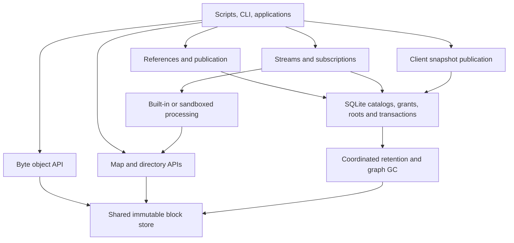

# Patchwork: streams, immutable objects, and published state

Design revision 2026-09-25. This is the system architecture and object contract; the [design index](index.md) explains status vocabulary and document ownership. No Git/IPFS wire compatibility, distributed storage or public hash-based access is implied.

## Product model

[Reference apps](reference-apps.md) exercises this model with expiring file shares/P2P, chat/video/recording, Automerge todos and quotes, and records the proposed Apps hosting/session/binding layer. These examples are design evidence, not first-release scope.

Patchwork supplies three data primitives:

1. **Objects:** immutable bytes, ordered maps and directories, identified by typed content roots.
2. **References:** stable resources with mutable, revisioned pointers to published objects.
3. **Streams:** ordered events and replay positions, including live and watch subscription modes.

Objects describe state. References identify published state. Streams describe events. Each can be used independently: uploading an artifact need not create a stream, and appending a record need not create a directory. Adapters are processing profiles over these primitives, not a fourth storage engine.

[Patchwork Functions](functions-design.md) provides shared execution profiles for endpoints, webhooks, consumers, filters, snapshot producers and jobs. Code is an immutable directory artifact; deployments bind approved resources/secret handles. Guest computation runs outside SQLite transactions and submits existing bounded commands through host-owned revision/policy checks. See [function conformance](function-conformance.md).

## Composition rules

| Capability | Reuse | Necessary specialized policy |
| --- | --- | --- |
| Directory / optional commit | Ordered maps and typed object descriptors | Entry validation and optional history retention |
| Snapshot | Object root + stream boundary + descriptor | Format compatibility and recovery acceptance |
| KV / derived indexes | Stream plus scoped SQLite materialization/checkpoint | Canonical events, CAS and replay rules |
| Multi-key app state | Immutable map batch + one reference CAS | Domain validator; coarse ref revision prevents phantom writes |
| Named pointers and short links | SQLite-indexed hierarchical references to immutable typed roots | Namespace admission, revision CAS and optional approved redirect-serving binding |
| App/function deployment | Immutable descriptors/code directories + channel references | Approved grants, domain routing and isolated execution |
| File share | Existing scoped grants + root protection + usage ledger | Secret redemption, expiry and concurrent admission |
| Snapshot/rebuild/thumbnail/delivery work | One durable job lifecycle and leases | Kind-specific capabilities; outbox is external-delivery work |
| Presence/signaling | Live events or short-retention streams and TTL state | Participant admission; reconnect/resync and metadata expiry |
| P2P/media | Existing signaling plus standard WebRTC/TURN integration | Transport lifecycle/accounting; not a new durable data engine |

Use purpose-specific service records only for authority, lifecycle or indexed operational state that the host must enforce. Do not invent a universal resource framework, second token scheme, public generic transaction API or per-app storage engine. A feature must justify new machinery with a correctness requirement or measured bottleneck.

For application state choose its authority explicitly: either stream events with a recoverable materialization, or a map root published by a reference. A derived index is never a second authority. An optional publication event records a ref transition; it does not by itself promise complete event-sourced reconstruction of every prior state. Immutable root queries need no predicate engine: host-record the reference revision and require it unchanged at commit. Coarse namespace revisions serve mutable built-in indexes; fine-grained predicates wait for measured contention.



Keep one SQLite database per instance, local content-addressed block files, and a single node. SQLite owns identity, grants, revisions, leases, stream records, publication and recovery metadata. Blocks hold large immutable data and tree nodes. The physical block layout may later use packing rather than one file per chunk; that choice must not change object identities.

## Objects and representations

The following are logical schemas, **not frozen binary layouts or ready HTTP bodies**.

| Kind | Logical contents | Required behavior |
| --- | --- | --- |
| `bytes/v1` | Total byte length; either inline bytes or sequence-tree root; format profile | Exact binary reconstruction, bounded range reads, streaming upload |
| Internal sequence node | Ordered chunk/child references and subtree byte lengths | Seek by cumulative length; preserve ordering and repeated chunks |
| `map/v1` | Ordered-map root and format profile | Byte-key ordering, immutable batch edits, point/range reads and diff |
| `directory/v1` | Ordered immediate-child entries under directory rules | Deterministic names, typed entries, efficient nested edits and traversal |
| `commit/v1` | Directory root, parent commit IDs, explicitly supplied descriptive metadata | Optional history/provenance; no implicit stream ordering or merge policy |

Internal blocks are chunks or typed encoded nodes. Chunks are terminal opaque bytes. Nodes have server-understood reference fields. A logical map value is explicitly one of inline opaque bytes or a typed object reference; a hash inside opaque bytes is not a reference. Directory file entries reference byte objects and directory entries reference directories. Large map values can reference byte objects rather than being embedded in leaves.

### Identity and canonical encoding

Proposed identity is a versioned, typed root identifier binding the object descriptor and its format profile. Cryptographic hashes address immutable blocks; the CDC rolling hash only selects boundaries and is never an integrity identifier. Prefixes, domain separation, algorithm codes and exact hashing preimages are specified in O-01 and frozen with tested golden fixtures in O-02.

The format profile pins encoding, key comparison, chunking algorithm/parameters, inline threshold and tree construction. Decoders reject duplicate fields, unsupported versions, malformed lengths, impossible node shapes, wrong referenced kinds and resource-limit violations. Configuration must never silently change the interpretation of an existing root. Canonical encoding must be independent of hash-map iteration, timestamps, machine architecture and mutation history for a given profile and logical value.

An object's structural root and `SHA256(all raw bytes)` are distinct identities. Compute the latter while handling a complete byte upload, and expose it as an optional verified digest. Composing existing objects must not promise that digest without reading the logical bytes. Objects with different profiles can represent identical bytes and have different roots. A supplied raw digest is verified before success; a raw digest is never substituted for a typed root.

Clients address public objects through descriptors. Do not expose a selected library's mutable `main`-branch encoding as Patchwork's permanent format. Adoption requires either a pinned interoperable encoding contract or a deliberately versioned wrapper and migration strategy. A tree root alone is insufficient if its interpretation requires an unstored library configuration.

### Content-defined byte chunking

Profiles are introduced in two steps. The first frozen byte profile uses fixed-size chunks under the same sequence-tree format; it has no external chunker dependency and unblocks durable blobs, snapshots and KV recovery. A CDC profile follows after G-CDC; clients see the same object API, and existing roots keep their profile. Under the CDC profile, stream uploads through a bounded chunker with minimum/target/maximum sizes. Store identical chunks once within the configured deduplication domain. Build the sequence manifest incrementally; large manifests use recursively grouped nodes with subtree byte lengths. HTTP framing and read-buffer sizes must not affect chunk boundaries. Small objects use one canonical inline form per profile; empty bytes have a defined representation.

Use a sequence tree for bytes and an ordered prolly map for keyed state. Do not model a byte sequence as `absolute offset -> chunk` if insertions would rewrite the whole suffix. Sequence nodes derive offsets from lengths and retain duplicate chunk occurrences in order.

Proposed composition is canonical within a profile: range reuse, splice and concatenation rechunk around joins and continue until chunker state/boundaries can safely resynchronize. There is no constant-cost splice guarantee; worst-case work may be large. If bounded local canonical reconstruction proves unsuitable, revisit the format explicitly rather than allowing history-dependent roots unnoticed. Operations exceeding synchronous work budgets become leased jobs or return an explicit limit error.

CDC reduces stored duplication; it does not by itself reduce bytes uploaded. Client-assisted transfer is a separate protocol. Already encrypted or whole-file-compressed inputs may share little content. Prefer any server-side compression after chunking and hashing logical chunk bytes; compression/encryption at rest must not redefine public identity. Chunk sizes, packing thresholds and compression remain benchmark decisions.

## Directory semantics

Each directory is a constrained ordered map of its immediate children, using the same map engine rather than a parallel tree implementation. Entries:

```text
file      { object: bytes_id, executable: bool }
directory { object: directory_id }
symlink   { target: utf8_string }
```

Names are nonempty, case-sensitive UTF-8 components, ordered by their exact UTF-8 bytes; reject `/`, NUL, `.` and `..`, and never silently normalize Unicode. Limits on name length, entry count and depth are part of the format/API gates. A structured array of path components is the preferred API representation, avoiding URL-decoding ambiguities. POSIX arbitrary-byte names, Windows name portability, devices, sockets and hard-link identity are not v1 filesystem guarantees. Exporters must reject or report unrepresentable names instead of silently renaming/colliding them.

Only content-relevant metadata is included by default: executable bit for files; no implicit mtime, upload time, UID or GID. Archival metadata can be a separately versioned explicit profile. An API-side hint such as a preferred download content type is not automatically a change to object identity.

Symlinks are inert by default. Explicit resolution has a hop/depth budget, stays within the supplied root, and rejects absolute or escaping targets. The server never resolves them through its host filesystem. Directory objects form a validated DAG; symlink cycles may be represented as strings but resolution terminates with a typed error. Shared subdirectories are permitted.

Batch edits operate against one expected base root. Define create/replace/delete/move/copy preconditions; reject conflicting ancestor/descendant edits, destination collisions and moving a directory into its descendant. For v1 reject ambiguous overlapping batches instead of inventing implicit operation order. Copy/move reuse subtree roots; changed ancestor directories are rebuilt. Failed edits leave the base root untouched and temporary outputs eligible for lease cleanup.

Commits are optional objects. Their root directory is a required dependency. Parent commit links are **history links**, subject to explicit history retention, not automatically a demand to retain every ancestor forever. An API requesting a collected parent reports history unavailable. Applications needing complete ancestry explicitly retain it. This distinction must be encoded and documented; a retained commit guarantees its tree contents, not unlimited history.

## API contracts

Public capabilities below are proposed; paths and schemas are finalized in O-07. No stub route should be added before the corresponding behavior and authorization work.

| Capability | Inputs | Result and consistency |
| --- | --- | --- |
| Upload bytes | Bounded stream; optional expected digest/profile | Immutable object descriptor and owner upload lease after durable completion |
| Read bytes | Object + authorized access context + optional range | Byte-exact response; work bounded to needed sequence paths/chunks |
| Compose bytes | Authorized source ranges + new bytes | New immutable root; no source mutation; explicit synchronous/job outcome |
| Edit map | Base root, bounded batch of key/value edits | New root; optional absent/value preconditions checked against base |
| Read map | Root, keys or bounded range/prefix | Root-bound pagination; counts/bytes/time capped |
| Edit directory | Base root, unambiguous path operations | New directory root with atomic batch semantics |
| Resolve/list directory | Root + path components, follow-links opt-in | Entries/object descriptor; bounded traversal/pagination |
| Diff | Two authorized roots of compatible kind/profile; optional range/path | Paginated logical changes; no implied chronological stream events |
| Transfer | Authorized roots/upload session and advertised profile | Verified missing-block exchange; no partially visible imported root |
| Publish reference | Stable ref ID, expected revision, candidate root, optional one-stream publication | Atomic head/revision/root update and optional retained record |

Prefer server-side batch operations over a network round trip per node. Pagination cursors bind roots, bounds and interpretation; cursors are not capabilities. Large transfers can use bounded block bundles; clients must not trust unchecked imported nodes. Compression bombs, cycles, extreme fanout/depth, invalid byte-length summaries and missing children fail validation within explicit budgets.

Basic HTTP clients can always upload/download whole bytes and issue JSON edit requests. Advanced clients can use shared chunk profiles, blocks and roots for efficient sync. A general user-facing block-by-hash endpoint is not necessary to support either workflow. Merkle proofs and three-way merge can be added after stable formats; proof paths must not expose sibling data to a restricted caller. Merge conflicts need application policy and do not imply a CRDT or distributed consensus guarantee.

## Publication, streams and snapshots

**References** are stable named pointers to one immutable Patchwork object root:

- **Identity.** Random stable ID, unique canonical hierarchical name, fixed target-kind constraint, lifecycle, monotonic revision and current root. Deletion and recreation give a new ID; name reuse never resurrects an old grant or cursor. No rename initially.
- **Names.** The shared resource-name grammar ([architecture](architecture.md#resource-model)); `/` separates components but no parent reference is required and a name is not a filesystem path or directory. No implicit creation on lookup.
- **Lookup.** SQLite owns a unique name index for exact resolution and bounded prefix listing. Listings use canonical-name keyset cursors, page budgets and per-item authorization. Pages are not a namespace snapshot: a name inserted before the cursor may be omitted, so clients needing a consistent inventory rescan. Name allocation and reference/root charges have quotas and measured capacity limits.
- **Update.** CAS uses the revision as well as the target, so A -> B -> A cannot let a stale edit succeed. Publication checks candidate kind, link authority, complete durable graph closure, policy and expected revision inside the existing coordinator.
- **Authorization.** Follows stable identity and current policy, never an unverified requested name. Prefix grants intentionally cover future names; exact-ID grants cannot.
- **Retention.** The current root is a durable GC owner. After replacement or deletion, only other owners, protected readers or leases retain the old root.

A reference is not an arbitrary-value KV row, URL target or second tree database. An external URL inside object bytes is not a graph edge and causes no fetch or retention. Public redirect serving over references is a separately approved binding specified in [later integrations](later-integrations.md#redirect-serving-bindings-g-redirect-r-09).

Prepare immutable blocks under a lease first. All required blocks must be durable and validated before a SQLite transaction publishes their root. A lost response after commit has an unknown outcome; publication requests need a scoped idempotency key or revision-based inspection. Root preparation does not grant permanent retention.

A reference binding can require publication to a fixed retained stream; callers cannot bypass that requirement through a bare CAS or omit its record. For such a reference, the publication command performs one atomic SQLite transaction: recheck reference/config/policy revisions and permissions, install the new root/reference revision, append exactly one validated publication record at the stream tail, establish its object roots, and save any retry receipt. Notify after commit. Pipeline rejection or drop means **no reference advance**; report an explicit non-publication result. A final built-in validator ensures transforms cannot misreport which root was published. This is a bounded operation involving one reference and one stream, not a general public cross-stream transaction API. Require reference-publish and stream-append rights (or an explicitly administered scoped binding); neither right implies the other.

Ordinary records link objects through explicit `object_refs`. Reading a record and reading referenced content remain separate permissions unless an explicit resource policy grants both. Watch-only credentials receive authorized change hints, not new object IDs or tree contents automatically.

A directory, map or opaque encrypted object root may be the payload of a typed stream snapshot. Clients are first-class producers alongside server adapters; see [client-produced snapshots](external-snapshots.md). Descriptors include stream ID, type, boundary P and producer/format/config provenance (adapter version only where applicable). A published root or commit is not automatically a valid snapshot. Producers reconstruct from a compatible seed plus records `[Q,P)`; the server cannot verify opaque or encrypted state semantically. Publication and acceptance as a recovery anchor require separate authority. All configured recovery requirements, including externally maintained ones, must be satisfied before trim; offline producers can stall retention. A root's identical content cannot replace a stream position. References without a publication stream can be polled with revisions/ETags; event-driven applications bind an existing stream rather than require another watch engine.

Keep transactional KV in SQLite. Its independent snapshot producer writes key revisions and tombstones in a byte-stream format first and an ordered-map format once the map engine is adopted, as defined in [processing](processing.md#kv-snapshot-format). This preserves one append transaction domain. Moving live KV into persistent trees requires measured benefit and equivalent atomic record/state/checkpoint behavior.

## Authorization, retention and durability

Separate permission to read, construct/link, publish, pin, inspect metadata and administer. Root IDs are identifiers, not bearer capabilities. Proposed directory access grants traversal of its typed content descendants; it does not grant commit-history traversal, arbitrary other roots, or mutation of a named reference. Fine-grained per-path directory ACLs are deferred. Ordinary map references may only confer descendant access under an explicitly documented root policy.

Construction requires authority to link each reused source subtree/object, or an upload session that establishes possession of its bytes. The server can internally reuse a physical block already present, but a client cannot claim it by guessing its hash. Root-scoped transfer sessions bind principal/credential, source roots, permitted graph and expiry; missing-block requests are restricted to that scope. For new bytes without such access, upload the bytes. Do not offer a global existence oracle. Recheck revocation during active work under the existing five-second bound; a GC pin or cursor never preserves authorization after revocation.

Use one coordinated object graph: SQLite tracks durable roots and leases; validated typed nodes describe direct required content edges; reachability traverses those edges. Opaque adapter payloads still declare dependencies explicitly. There is no need to duplicate a whole recognized directory closure for each snapshot. Validate and register immutable edges once, and protect closure before publication. Deduplication changes physical accounting, not logical ownership or quota: default charge logical referenced bytes per owning resource, and report physical storage separately. Exact quota aggregation awaits measurements.

Root owners include named references, retained record links, typed snapshots/recovery anchors, explicit pins and unexpired upload/job/transfer leases. New readers/jobs acquire protection before a root can become a collection candidate. Deleting a reference removes only its own root; another snapshot or lease may still retain shared content. Parent-history retention is separately selected as described above. Never allow a library's independent collector to sweep Patchwork's shared store.

Physical collection is an online, epoch-fenced mark/sweep with a write barrier on reuse of existing nodes ([storage](storage.md#block-finalization-and-graph-collection)); writes continue during a cycle. Crashes may leak blocks but cannot remove required content. Until G-GRAPH proves the barrier, collection stays disabled rather than pausing writes; do not substitute a stale root listing for the barrier. Logical stream trim remains its own transactional operation and can leave physical collection for later.

File-backed block finalization still requires temporary files, digest verification, synchronization, atomic installation and directory durability before catalog publication. SQLite remains WAL/FULL. Restart reconciles partial uploads, expired jobs, orphan blocks and interrupted deletions. Online backups include required blocks, root/catalog state and secrets from a consistent database copy while sweeps are excluded. Hash verification detects corruption; it does not restore missing blocks. Fault injection and restore evidence remain release gates.

## Implementation boundaries and adoption gates

Keep modules initially: `model` for checked IDs/profiles; `store` for SQLite/catalog/transactions; `objects` for block access and typed traversal; `bytes` for chunking/sequence operations; `trees` for ordered maps; `directories` for entry/path rules; `publication` for references and optional record commits. Existing planned `auth`, `pipeline`, `retention`, `subscriptions` and extension boundaries remain. Introduce modules only with implemented behavior, not empty traits for every future backend.

`crabbuild/prolly` is a candidate ordered-map engine, not an assumed byte-rope implementation or replacement for host lifecycle/auth policy. FastCDC is a candidate chunker. Pin evaluated versions/commits, check licenses/dependency compatibility and run real tests before selecting either. Reuse map/block machinery for sequence nodes where measured and correct; cumulative byte lengths and canonical joins may still need sequence-specific logic. Do not add a second authoritative database or independent collector through library integration.

| Gate | Evidence needed | Blocks |
| --- | --- | --- |
| G-FORMAT | Canonical encodings/IDs/profiles, golden fixtures, malformed-input limits, upgrade policy | Public persistent object formats |
| G-CDC | Stream-boundary independence, sparse-edit reuse, canonical composition, range-read correctness, memory/CPU bounds | Chunked blob adoption |
| G-PROLLY | Pinned-library interoperability, deterministic roots, diff/update performance, store/transaction integration | Ordered-map engine adoption |
| G-GRAPH | Root/edge validation, lease/GC races, restart/fault/backup tests, history-edge semantics | Physical collection and durable publication |
| G-OBJECT-AUTH | Descendant access, linking, transfer-session scoping, revocation and no hash-existence oracle | Public object/tree/directory APIs |

These supplement G-AUTH, G-SSH, G-DURABILITY and G-LIMITS. Gates apply to the feature being enabled: internal object prototypes do not require public authorization or physical GC to exist. Publication needs its closure/durability subset; enabling collection additionally needs the full GC proof. Full Git/IPFS protocols, filesystem mounts, distributed replication/consensus, unrestricted native code, transparent per-path ACLs and generic merge automation remain outside the initial implementation. Approved Functions have their own gates.

## Build order and design validation

The detailed O-01–O-09 tasks and OBJ test IDs are in [object conformance](object-conformance.md) and [roadmap](roadmap.md). Object work starts after the streams release (see [roadmap](roadmap.md#release-stages)). O-01 defines logical contracts; O-02 first freezes the descriptor/ID scheme with a simple fixed-chunk byte profile, which unblocks durable blobs and KV snapshots. CDC and ordered-map profiles are adopted later as additional profiles, without reinterpreting existing roots.

Target examples for the design:

- A shell script uploads bytes and appends a record referencing the resulting object.
- A build publishes a directory artifact by CAS; unchanged files and chunks are reused.
- A workspace edits several paths in one immutable batch and optionally creates a commit.
- A KV adapter creates structurally shared snapshots and safely trims covered stream history.
- A client pins an authorized root, compares it with another, and transfers only missing content.

These are acceptance scenarios for future implementation, not claims of existing endpoints. Measure logical versus physical bytes, block count, bytes rewritten/transferred, CPU, peak memory, range-read amplification and restore time on named hardware. Include random/incompressible inputs, already-compressed/encrypted data, repeated chunks, prefix insertions, sparse map changes and adversarial small chunks. No expected constant-time behavior or deduplication ratio is a product guarantee.

Implementation references: [prolly project](https://github.com/crabbuild/prolly), [architecture](https://github.com/crabbuild/prolly/blob/main/docs/architecture.md), [format releases](https://github.com/crabbuild/prolly/blob/main/CHANGELOG.md), and [FastCDC Rust implementation](https://github.com/nlfiedler/fastcdc-rs). Documentation review is not a completed adoption or durability gate.
